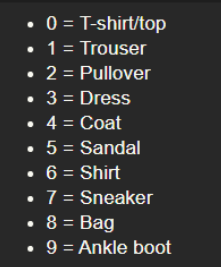

# Image-Denoising-AE
Image Denoising using AutoEncoders in Keras

Link to awesome article : [view](https://towardsdatascience.com/autoencoders-and-the-denoising-feature-from-theory-to-practice-db7f7ad8fc78)

## Learning Objectives

- Understand the theory and intuition behind Autoencoders
- Import Key libraries, dataset and visualize images
- Perform image normalization, pre-processing, and add random noise to images
- Build an Autoencoder using Keras with Tensorflow 2.0 as a backend
- Compile and fit Autoencoder model to training data 
- Assess the performance of trained Autoencoder using various KPIs 

## Walkthrough

- Import libraries and datasets
- Perform data visualization
- Perform data preprocessing
- Understand the theory and intuition behind autoencoders
- Build and train autoencoder model
- Evaluate trained model performance

## Approach

- We need both the noisy image and the clean image for training the DAE.
- The noisy image could be synthesized by adding gaussian noise to the original input images.
- The noisy images would be fed to the DAE and the output ie. the reconstructed input will be compared with the clean image.
- The objective of the DAE is to minimize the reconstruction error which is the difference between the clean input image and the generated output image.

### Note: 

- While training the DAE (model.fit(...)) pass the noisy image as the input but in the ouput part pass the clean version ie. the original input image.
- The reconstruction error is between the generated output and the clean input image.
- This will ensure that given the noisy input, the DAE will produce a denoised version of the image by extracting important features in the coding bottleneck layer.

## FMNIST Dataset

Fashion-MNIST is a dataset of Zalando's article images—consisting of a training set of 60,000 examples and a test set of 10,000 examples. Each example is a 28x28 grayscale image, associated with a label from 10 classes.

